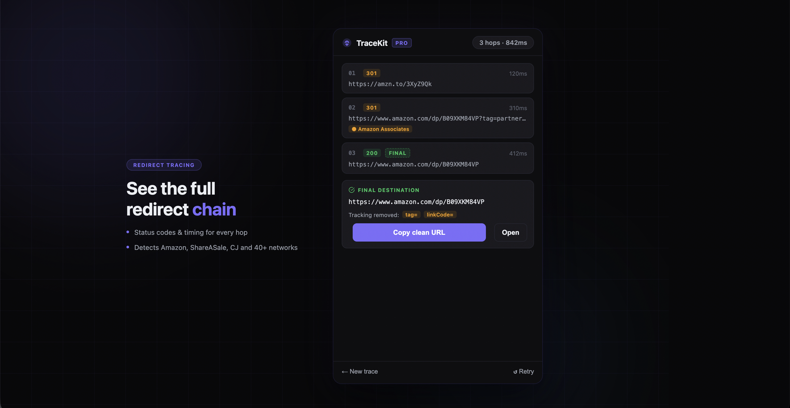

# TraceKit — Redirect & Affiliate Inspector



**Reveal the full redirect chain behind any link. Spot affiliate networks, tracking parameters, and the real final URL — instantly.**

[](https://buy.stripe.com/14A8wO840goe56t1QD4ow04)

A Chrome extension that traces every hop in a URL's redirect chain, identifies known affiliate networks (Impact, ShareASale, CJ, Awin, Rakuten, PartnerStack, Amazon Associates, Skimlinks, and 40+ more), strips tracking parameters, and surfaces the clean destination — all without leaving your browser.

> **Built for** affiliate marketers auditing competitor links · SEO professionals checking redirect chains for crawl waste · journalists tracing sponsored links · privacy-conscious users who want to know where a link actually goes before clicking.

---

## Features

### Free
- Right-click any link → "Trace this link with TraceKit"
- Paste any URL into the popup to trace
- Full redirect chain with HTTP status codes (color-coded 2xx / 3xx / 4xx / 5xx)
- Affiliate-network detection on each hop with brand-color badges
- UTM / tracking-parameter inspector
- One-click "Copy clean URL" with all trackers stripped
- Up to 15 hops per trace
- HTTP `Refresh:` header following (handles Facebook `l.php`-style interstitials)

### Pro (one-time $9 unlock)
- **Deep trace** — opens the URL in an isolated background tab and follows JavaScript-driven redirects (Auth0, Clerk, Firebase, custom session checks) that HTTP-only tracers can't see
- **Bulk trace** — paste up to 10 URLs and trace them all at once
- **Page link scanner** — scans the active tab and surfaces every affiliate, shortener, and tracking link on the page before you click any of them
- **Skip redirects on click** — automatically navigates to the final destination when you click tracked links, bypassing the redirect chain entirely
- **Side-by-side compare** — diff two redirect chains and spot where they diverge
- **Trace history** — last 50 traces stored locally; recent traces shown on the home screen
- **Export** — JSON or CSV, per-trace or bulk batch
- **Webhook** — push trace results to any endpoint automatically or on demand

---

## Privacy

TraceKit runs entirely in your browser. **URLs you trace are never sent to TraceKit's developer or any third party.** All redirect-following uses Chrome's built-in `fetch` and `webRequest` APIs against the destination directly.

The only network traffic that leaves your browser to a TraceKit-controlled server is **license-key verification** — which sends only your license key (no browsing data) to confirm Pro status. Once verified, Pro works offline.

Trace history (Pro feature) lives in `chrome.storage.local` — never synced anywhere.

---

## Install

**From the Chrome Web Store:** *(submission in progress)*

**Load unpacked (developer install):**

1. [Download TraceKit.zip](https://github.com/clashrelated/tracekit/releases/latest/download/TraceKit.zip) and unzip it
2. Open `chrome://extensions`
3. Toggle on **Developer mode** (top-right)
4. Click **Load unpacked** → select the unzipped folder

> Don't use GitHub's "Download ZIP" button — it includes extra files and a nested folder that Chrome won't accept.

---

## Architecture

Pure-frontend Chrome extension on Manifest V3. No bundler, no transpiler — direct ES modules in the service worker, popup, and options page.

```
manifest.json              → MV3 config, permissions, action/options/icons
background.js              → service worker: context menu, trace orchestration, history, auto-trace registration
content/scan.js            → Pro page-scanner content script (registered programmatically)
content/skip-redirect.js   → Pro skip-redirects-on-click content script (mousedown capture)
popup/                     → toolbar popup UI (idle, tracing, results, bulk, history, error states)
options/                   → settings page (Pro status, license verify, auto-trace toggle, privacy notes)
icons/                     → 16/32/48/128 PNGs + master SVG
utils/
├── tracer.js              → core redirect tracer (HTTP-level via webRequest) + Pro deepTraceUrl (incognito-tab-based)
├── affiliates.js          → 50+ affiliate / shortener / tracker pattern definitions
├── params.js              → UTM + click-ID stripping
├── license.js             → Pro state, license verify, device-ID per Chrome installation
├── history.js             → trace history persistence (chrome.storage.local, 50-entry cap)
└── settings.js            → user settings (auto-trace, skip-redirects, webhook URL, etc.)
```

### How redirect tracing actually works

- **HTTP redirects (3xx + Location header)** — captured via `chrome.webRequest.onBeforeRedirect` with the requestId of the original navigation. Cross-origin `redirect: 'manual'` opaqueredirect responses don't expose the Location header per fetch spec, so we use `redirect: 'follow'` and observe the chain via webRequest instead.
- **Refresh-header redirects** — when a chain ends at 200 with an HTTP `Refresh: <delay>; url=<target>` header (Facebook's `l.php` interstitial does this), we parse the target and continue tracing.
- **JS-driven redirects (Pro deep trace)** — the URL is opened in an isolated incognito window with `chrome.windows.create({ incognito: true, ... })`, listeners are attached to that window's tabId, and the actual navigation is triggered via `chrome.tabs.update` (after listeners are armed, to avoid the race condition where fast pages load before observation). When navigation settles, the window is closed.
- **Affiliate detection** — pure URL pattern matching against a curated list. No external API calls.

---

## Development

```bash
git clone https://github.com/clashrelated/tracekit.git
cd tracekit
# That's it — no install step. It's vanilla JS modules.
# Load the directory as an unpacked extension in chrome://extensions.
```

Useful entry points to read:
- `utils/tracer.js` — start here for the core redirect logic
- `background.js` — message routing, history wiring
- `popup/popup.js` — UI states and rendering

---

## License

Source code: [MIT](LICENSE).

Pro features are gated by a license key issued at purchase, not by source obfuscation — you're welcome to read, learn from, and fork the code. To support continued development of TraceKit, please buy Pro rather than self-hosting your own verify endpoint.

---

## Credits

Built by [@clashrelated](https://github.com/clashrelated). Icon design and UI by the same. Bug reports and feature requests welcome via GitHub Issues.
